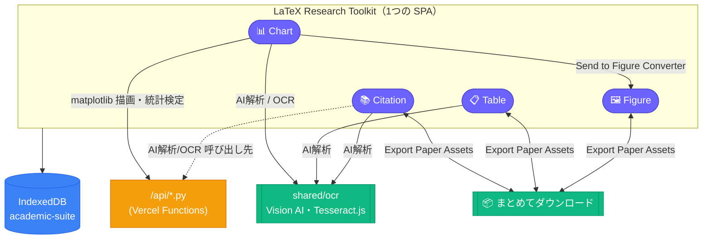
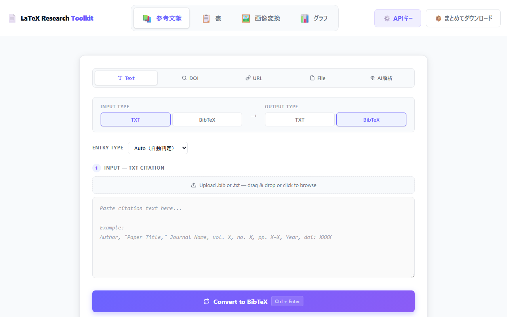
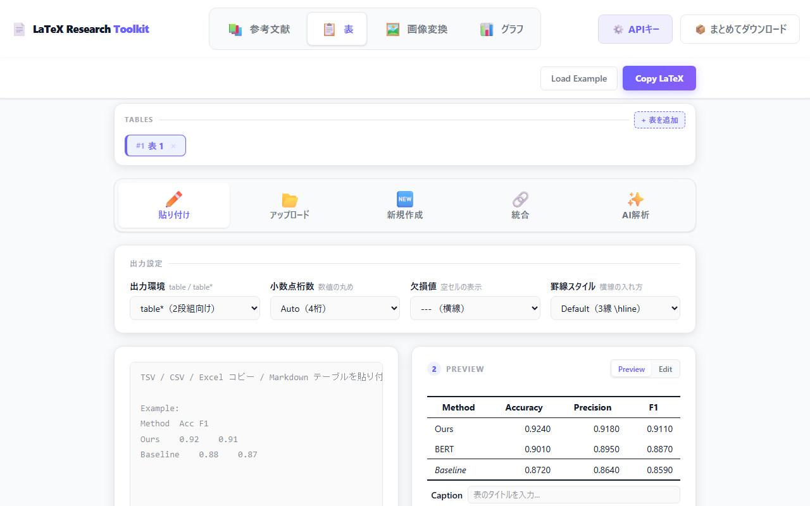
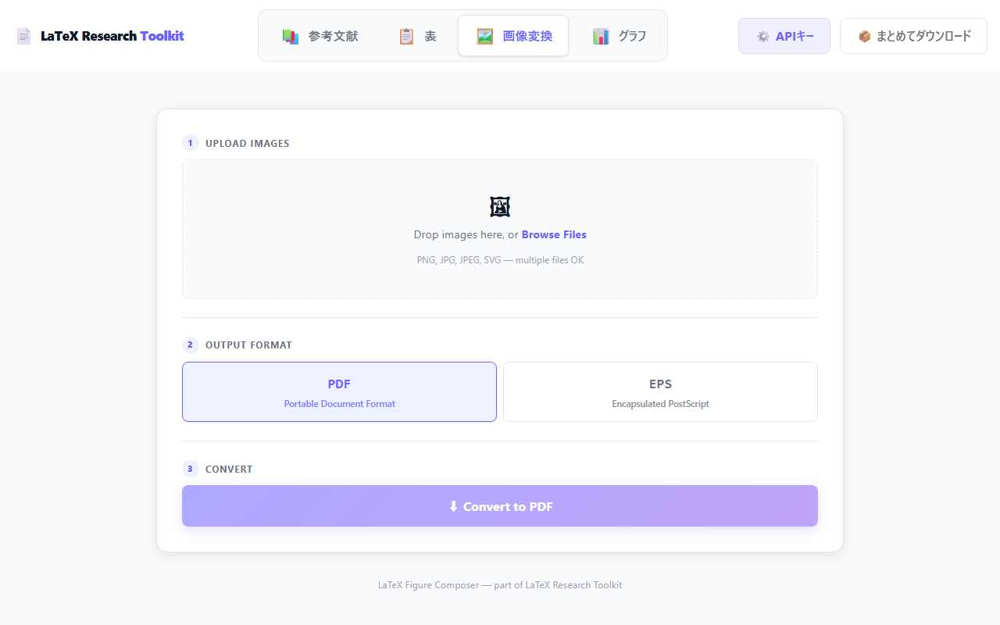
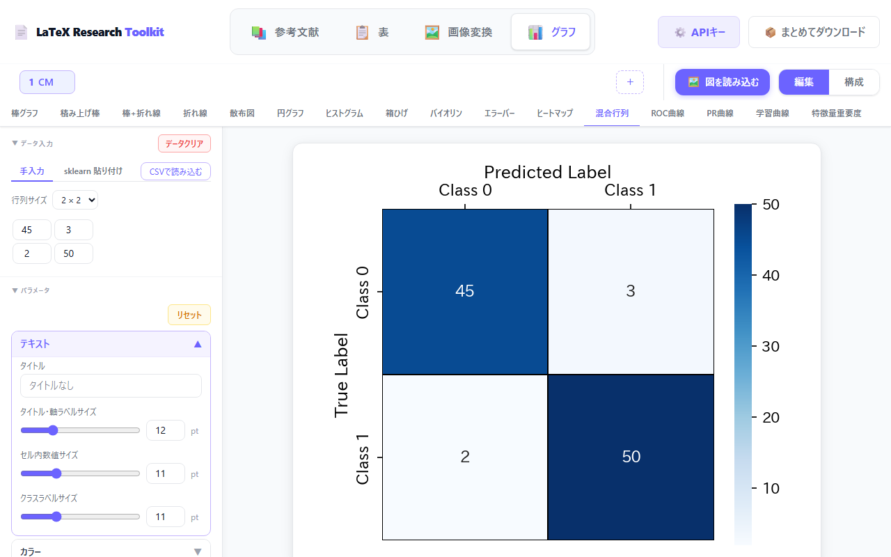

# LaTeX Research Toolkit

**論文執筆に必要な「引用・表・図・グラフ」の変換作業を1つに統合した研究支援 Web アプリケーション**

[](https://react.dev)
[](https://www.typescriptlang.org)
[](https://vitejs.dev)
[](https://tailwindcss.com)
[](https://zustand.docs.pmnd.rs/)
[](https://vitest.dev)
[](https://www.python.org)
[](https://matplotlib.org)
[](docs/02-integrations.md)
[](https://sentry.io)
[](https://latex-research-toolkit.vercel.app/)
[](LICENSE)

---

## プロジェクト概要

論文執筆では「引用文献の形式変換」「実験結果の表化」「画像の LaTeX 用フォーマット変換」「matplotlib 図の調整」という、それぞれ独立した定型作業が発生します。本プロジェクトは、もともと個別の課題として開発した4つの Web アプリを、実際にデータを渡し合える**1つの統合 SPA** としてまとめたものです。

- 📚 **参考文献（Citation）**：引用テキスト・BibTeX 相互変換、DOI/URL からの自動取得、BibTeX Library
- 📋 **表（Table）**：実験結果・CSV・sklearn 出力などを論文向け LaTeX 表に変換・編集
- 🖼️ **画像変換（Figure）**：PNG/JPG/SVG を `\includegraphics` 向けの PDF/EPS に変換
- 📊 **グラフ（Chart）**：matplotlib ベースの16種類の学術図を生成・編集・合成

単にタブを並べただけではなく、**Chart で作った図をそのまま Figure Converter に送る**、**Citation・Table・Chart の成果物を1つの ZIP にまとめてダウンロードする**など、モジュール間でワークフローとして繋がる連携機能を実装しています。

**公開 URL：** https://latex-research-toolkit.vercel.app/

---

## 課題背景

千葉工業大学 2026年前期「Web3・AI概論」の個別課題として開発した以下4つの Web アプリを、実際に連携する1つのアプリへ統合したものです。本統合版は、コンテスト **CHIBATECH PROTOTYPE** への応募作品として提出します。

**解決したかった問題：**
上記4つの定型作業は、それぞれ別々のツール・別々のタブで行うと「表は作ったが引用文献リストは別ツールで作業していた」「Chart で作った図を Figure Converter に通すのに一度ダウンロード→再アップロードが必要」といった余計な手間が発生する。1つのワークスペースにまとめ、成果物を1アクションで持ち出せるようにしたかった。

**対象ユーザー：**
LaTeX / Overleaf で論文を書く学部生・大学院生・研究者。

**一言紹介：**
引用・表・図・グラフの変換をまとめて済ませ、論文用アセットを1つの ZIP で持ち出せる、研究者のための統合ツールキット。

---

## 統合前の4プロジェクト

本プロジェクトは以下4つの個別課題のコードをベースに統合しています。各課題は単体でも別デプロイのまま公開を維持しています。

| 役割 | 個別リポジトリ | 個別デプロイ |
|---|---|---|
| Citation ⇄ BibTeX 相互変換 | [citation-bibtex-converter](https://github.com/Axe0320/citation-bibtex-converter) | https://citation-bibtex-converter.vercel.app/ |
| 表データ → LaTeX table 変換 | [latex-table-composer](https://github.com/Axe0320/latex-table-composer) | https://latex-table-composer.vercel.app/ |
| 画像 → LaTeX 向け PDF/EPS 変換 | [latex-figure-composer](https://github.com/Axe0320/latex-figure-composer) | https://latex-figure-composer.vercel.app/ |
| データ → matplotlib グラフ生成・編集・合成 | [figure-modification](https://github.com/Axe0320/figure-modification) | https://figure-modification.vercel.app/ |

---

## アーキテクチャ



- **状態管理**：単一のグローバルストアにはせず、Citation/Table/Figure はモジュールローカルな `useState`、Chart のみ Zustand をそのモジュール内にスコープ
- **永続化**：Citation Library・Table の複数表セッション・Chart の図データを、共有 IndexedDB（`academic-suite`）に統一
- **バックエンド**：Python（Vercel Functions）は matplotlib 描画・統計検定・Vision AI 呼び出しのみに使用。Citation/Table/Figure の変換処理はすべてブラウザ内で完結

---

各モジュール（Citation ⇄ BibTeX Converter / LaTeX Table Composer / LaTeX Figure Composer / Figure Modification）の内部構造・処理パイプライン・データモデルの詳細図は [docs/architecture/](docs/architecture/README.md) にモジュールごとのページとしてまとめています。

---

## 各モジュールの機能

### 📚 参考文献（Citation）
→ 詳細構造：[docs/architecture/citation.md](docs/architecture/citation.md)
- 引用テキスト（TXT）→ BibTeX 変換（日本語含む15形式の自動判定）
- BibTeX → IEEE / APA / ACM / Nature / Springer / MLA / Chicago / Harvard / Pandoc 形式へ変換
- DOI・論文 URL からの引用情報自動取得、複数文献の一括変換
- BibTeX Library（IndexedDB 永続化）
- **AI解析**：引用文献リストのテキスト・ファイルを AI（Claude / GPT-4o / Gemini）に投げて自動抽出

### 📋 表（Table）
→ 詳細構造：[docs/architecture/table.md](docs/architecture/table.md)
- TSV / CSV / Excel コピー / Markdown テーブル / sklearn の classification report を自動検出して LaTeX 表に変換
- セル編集・注釈（`\tnote{}`）・複数表の統合（Merge）・複数表タブ管理（永続化対応）
- 罫線スタイル・小数点桁数・欠損値表記などの出力設定
- **AI解析**：整形前のテキストやファイル（CSV等）を AI に投げて表データとして取り込み

### 🖼️ 画像変換（Figure）
→ 詳細構造：[docs/architecture/figure-convert.md](docs/architecture/figure-convert.md)
- PNG / JPG / SVG を `\includegraphics` 向けの PDF / EPS に変換（バッチ処理対応）
- SVG はベクター PDF としてネイティブ変換（劣化なし）
- 変換済みファイルごとに `\begin{figure}...\end{figure}` の LaTeX コードを生成

### 📊 グラフ（Chart）
→ 詳細構造：[docs/architecture/chart.md](docs/architecture/chart.md)
- 16種類の学術図（棒グラフ・散布図・ROC曲線・混合行列・学習曲線 等）を生成・編集
- 手入力・CSV貼り付け・sklearn出力貼り付けに対応。統計有意差ブラケット（t検定・Mann-Whitney U検定）を自動描画
- Compose モードで複数図を1枚に合成
- 図の画像を Vision AI / Tesseract.js で解析してデータを抽出（OCR）
- 生成した図をそのまま Figure Converter へ送信可能

### 連携機能（4モジュール共通）
- **📦 まとめてダウンロード**：Citation Library・Tableの表・Chartの図をまとめて1つの ZIP として出力
- **共通 AI解析基盤**：Claude / GPT-4o / Gemini の API キーはブラウザの localStorage にのみ保存し、共通ヘッダーの「⚙️ APIキー」からどのタブでも設定可能

---

## Screenshot

| 参考文献（Citation） | 表（Table） |
|---|---|
|  |  |

| 画像変換（Figure） | グラフ（Chart） |
|---|---|
|  |  |

---

## 技術スタック

| 項目 | 採用技術 |
|---|---|
| Frontend | React 19.2 / TypeScript 6.0 / Vite 8.1 |
| Styling | Tailwind CSS 4（+ 一部モジュールは Plain CSS を `*-module` クラスでスコープ） |
| 状態管理 | React `useState`（モジュールローカル）+ Zustand（Chart のみ） |
| 永続化 | IndexedDB（`idb`） |
| Backend | Python 3.12（Vercel Functions）+ matplotlib / seaborn |
| OCR / AI解析 | Anthropic Claude / OpenAI GPT-4o / Google Gemini（Vision & Text）、Tesseract.js（ブラウザ内 OCR、Chart のみ） |
| その他 | jspdf / pdf-lib / svg2pdf.js（Figure）、xlsx（Table）、jszip（まとめてダウンロード） |
| テスト | Vitest |
| モニタリング | Sentry（本統合アプリ専用プロジェクト。旧4デプロイのSentryプロジェクトとは分離） |
| AI Assistant | Claude Code (Anthropic) |
| Deployment | Vercel |

---

## セットアップ

```bash
npm install
npm run dev    # 開発サーバー起動（Vite）
npm run build  # 本番ビルド（tsc -b && vite build）
npm run test   # Vitest 実行
npm run lint   # oxlint 実行
```

Python バックエンド（Chart モジュール用）をローカルで動かす場合は `scripts/dev-api-server.py` を使用してください（Vercel Functions と同じハンドラをそのままローカル実行し、Vite の `server.proxy` で `/api/*` に転送します）。

---

## 制限事項

- Vision AI（Claude / GPT-4o / Gemini）を使う AI解析機能には、各サービスの API キーが必要です（ブラウザの localStorage にのみ保存、サーバーには送信されません）
- Chart の画像 OCR で Tesseract.js（ブラウザ内・無料）を使う場合、混合行列・ヒートマップ以外は抽出精度が低く手動修正が必要です
- Citation の DOI/URL 自動取得は、IEEE / ScienceDirect 等ボット対策のあるサイトで失敗することがあります
- 4モジュールとも本番の永続化はブラウザの IndexedDB に依存するため、ブラウザのデータ削除の影響を受けます

---

## 設計ドキュメント

統合の検討過程・決定事項は `docs/` 配下に残しています。

- [INTEGRATION_PLAN.md](INTEGRATION_PLAN.md) — 統合計画のインデックス
- [docs/00-overview.md](docs/00-overview.md) — 対象リポジトリ・現状分析・リポジトリ運用方針
- [docs/01-architecture.md](docs/01-architecture.md) — バージョン統一方針・ディレクトリ構造・永続化・UI設計
- [docs/02-integrations.md](docs/02-integrations.md) — 機能連携設計・Vision AI OCR展開
- [docs/03-tech-alignment.md](docs/03-tech-alignment.md) — Lint・共通UI・テスト等の横展開項目
- [docs/04-risks.md](docs/04-risks.md) — リスクと残課題
- [docs/architecture/](docs/architecture/README.md) — モジュール別（4ファイル）の内部構造・処理パイプライン・データモデル詳細図
- [docs/decisions-log.md](docs/decisions-log.md) — 判断が変わった/確定した事項の時系列ログ
- [docs/phases/](docs/phases/README.md) — Phase 1〜8 の詳細計画

---

## Version History

| Version | 内容 |
|---|---|
| v1.0 | 4つの個別課題（Citation / Table / Figure / Chart）の統合、機能連携（Export Paper Assets・Chart→Figure送信・共通AI解析基盤）、デザイン統一、Vercel本番デプロイ |

---

## 備考

本リポジトリは、千葉工業大学「Web3・AI概論」の課題要件である以下を満たすよう作成しています。

1. AI 支援（Claude Code）を活用したプロダクト開発
2. 研究・学習上の実課題を解決するプロダクトの試作
3. GitHub へのソースコード公開
4. Vercel へのデプロイ

**本統合版（LaTeX Research Toolkit）は、上記4つの個別課題（citation-bibtex-converter / latex-table-composer / latex-figure-composer / figure-modification）を実際に連携する1つのアプリとして統合し、コンテスト CHIBATECH PROTOTYPE への応募作品として提出するものです。**

---

## License

[MIT License](LICENSE)
