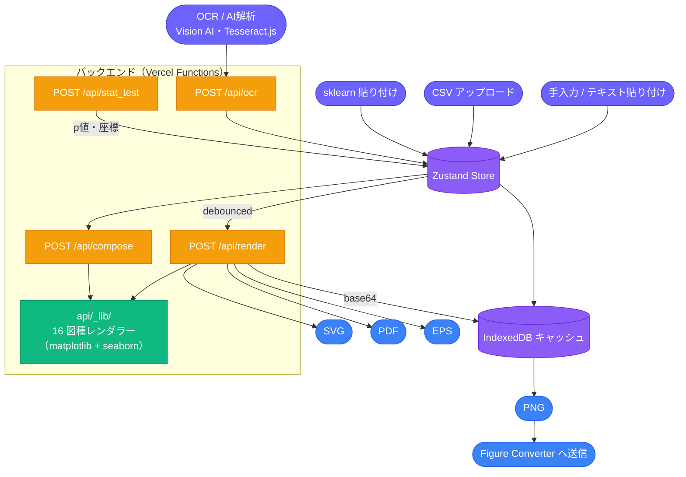
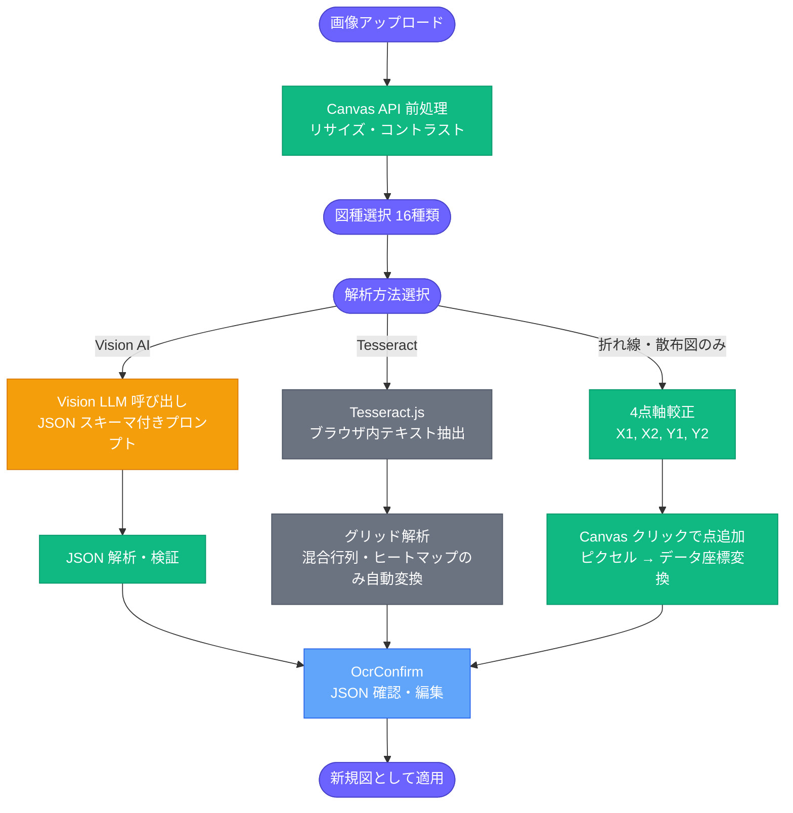
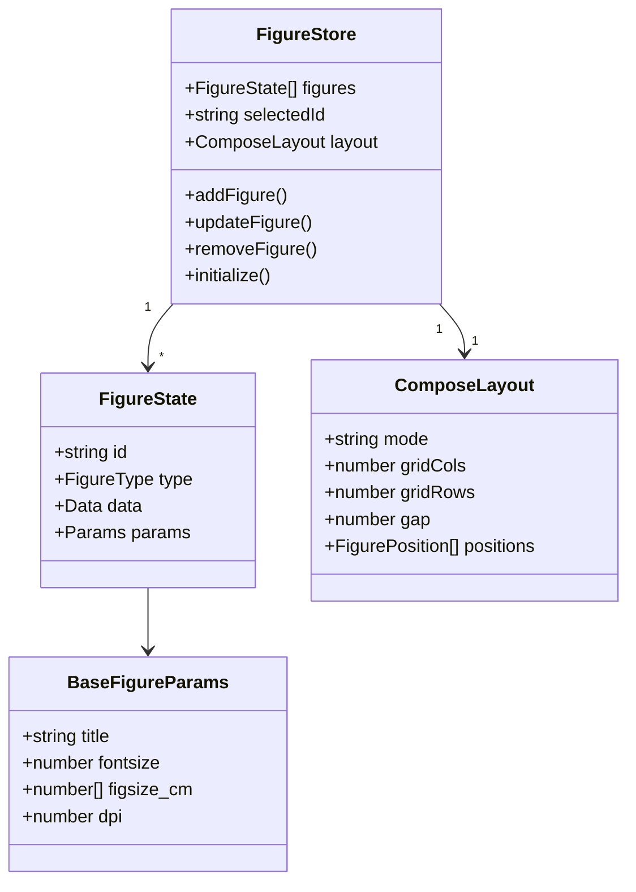

# グラフ（Figure Modification）

[← アーキテクチャ一覧](README.md) | [← README.md](../../README.md)

### 主な機能・技術

- 16種類の学術図（棒グラフ・散布図・ROC曲線・混合行列・学習曲線 等）を生成・編集できる
- 手入力 / CSVアップロード / sklearn出力貼り付け / OCR・AI解析の4系統の入力に対応
- 統計有意差ブラケット（Welch's t検定・Mann-Whitney U検定）を自動計算し、図上に直接描画する
- Compose モードで複数図を1枚に合成し、PNG / SVG / PDF / EPS で出力できる
- バックエンドは Python（Vercel Functions）+ matplotlib / seaborn。画像OCRは Vision AI（Claude / GPT-4o / Gemini）と Tesseract.js の両方に対応

### システム全体



複数色のノード（オレンジのAPI呼び出し・緑のレンダラー）を1つの「バックエンド」としてまとめる意味がある箇所のみ、枠を残している。他の箇所は色分けだけで区別できるため枠を使っていない（`docs/architecture/README.md` の凡例を参照）。

### OCRパイプライン



### データモデル



### 主要ファイル

```text
src/modules/chart/
├── components/{input,editor,compose,import,preview}/
├── store/figureStore.ts           # Zustand（chartモジュールにスコープ）
├── hooks/useOcr.ts
├── api/{figureApi,ocrApi}.ts
└── ChartModule.tsx

api/
├── render.py / compose.py / ocr.py / stat_test.py / extract.py
└── _lib/                          # 16図種レンダラー・統計検定・Vision AI呼び出し
```

### 設計上の要点

- **`debounced` レンダリングと IndexedDB キャッシュ**：パラメータ変更のたびに `/api/render` を呼ぶとコストが高いため、デバウンスした上で結果を IndexedDB にキャッシュし、再訪時はキャッシュから即座に PNG を復元する。
- **画像OCRはChartにのみ残す**：Citation・Tableは統合時にテキスト/ファイルベースのAI解析へ置き換えたが、Chartは「グラフの画像そのものがデータ」であるため、画像OCR（Vision AI + Tesseract.js）の必要性が本質的に異なり、そのまま維持している（[docs/02-integrations.md](../02-integrations.md) §3.3）。
- **Tesseract.jsは補助手段**：APIキー不要でブラウザ内完結するが、混合行列・ヒートマップ以外は手動修正が前提（自動抽出不可のため、折れ線・散布図では手動点取りUIにフォールバックする）。
- **統計有意差ブラケット**：`stat_test.py`がWelch's t検定・Mann-Whitney U検定のp値を計算し、図上に直接ブラケットとして描画する。scipy依存を排除し、純Python実装（`api/_lib/stats_lite.py`）に置き換え済み（Vercelのバンドルサイズ制限対応、[docs/decisions-log.md](../decisions-log.md)）。
