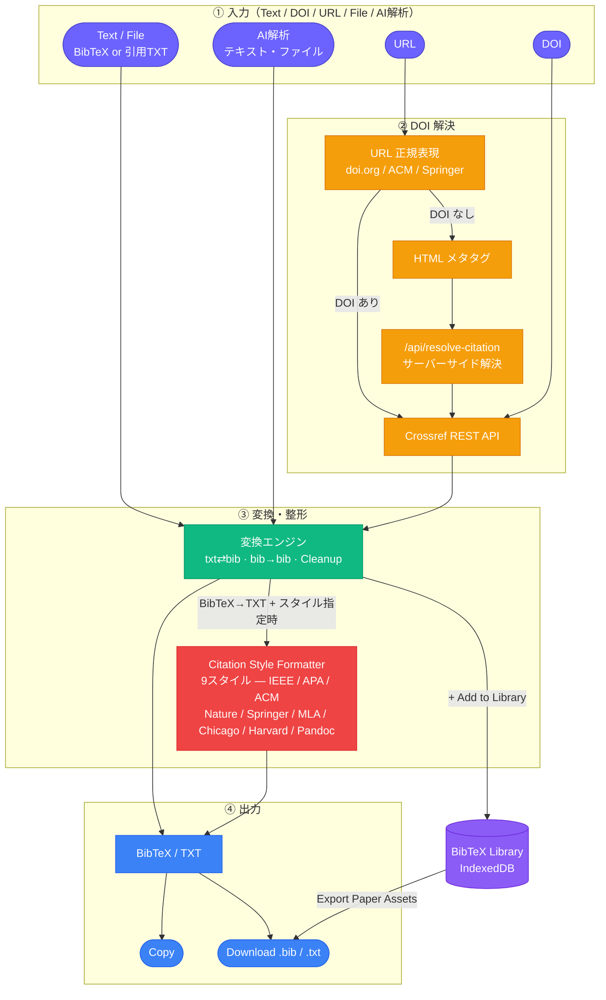
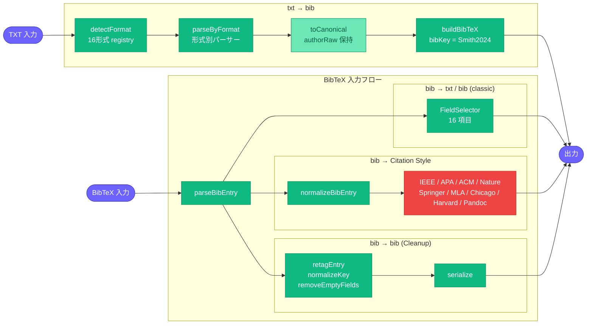

# 参考文献（Citation ⇄ BibTeX Converter）

[← アーキテクチャ一覧](README.md) | [← README.md](../../README.md)

### システム全体



### 変換エンジン詳細



### 主要ファイル

```text
src/modules/citation/
├── lib/
│   ├── citation/                 # TXT → BibTeX 変換
│   │   ├── parsers/{english,japanese}.ts  # 15形式（日本語4形式含む）
│   │   ├── detect.ts              # detectFormat registry（priority順）
│   │   ├── canonical.ts           # CanonicalCitation
│   │   └── builder.ts             # buildBibTeX
│   ├── bibtex/                   # BibTeX → TXT 変換・整形
│   │   ├── formatters/            # 9 Citation Style Formatters
│   │   ├── normalize/             # 著者分割・正規化
│   │   └── cleanup.ts             # retagEntry / normalizeKey
│   └── library/                   # BibTeX Library（IndexedDB永続化）
├── components/
│   ├── FieldSelector.tsx          # フィールド選択（16項目）
│   ├── LibraryPanel.tsx           # BibTeX Library UI
│   └── OcrImport.tsx              # AI解析（テキスト・ファイル→抽出）
└── CitationModule.tsx
```

### 設計上の要点

- **16形式パーサーの registry パターン**：`detectFormat` は優先度順にソートされたパーサー配列を試行するため、新しい引用形式の追加は配列に1エントリ追加するだけで済む。
- **Canonical layer**：`toCanonical()` で著者名の生表記（`authorRaw`）を保持したまま正規化することで、`Smith2024` のような筆頭著者キー生成と、フォーマッタ側での表示用整形（`normalizeBibEntry`）を分離している。
- **AI解析（統合時に追加）**：画像OCRではなく、参考文献リストのテキスト・ファイルを直接 AI（Claude / GPT-4o / Gemini）に渡して構造化抽出する方式。抽出結果は既存の TXT パースパイプラインにそのまま流し込むため、専用の確認UIを新設していない（[docs/02-integrations.md](../02-integrations.md) §3.3）。
- **DOI解決のSSRF対策**：`/api/resolve-citation` はサーバーサイドで任意URLを fetch するため、DOI形式または既知の学術ドメインのみを許可するアローリストで入力を制限している。
