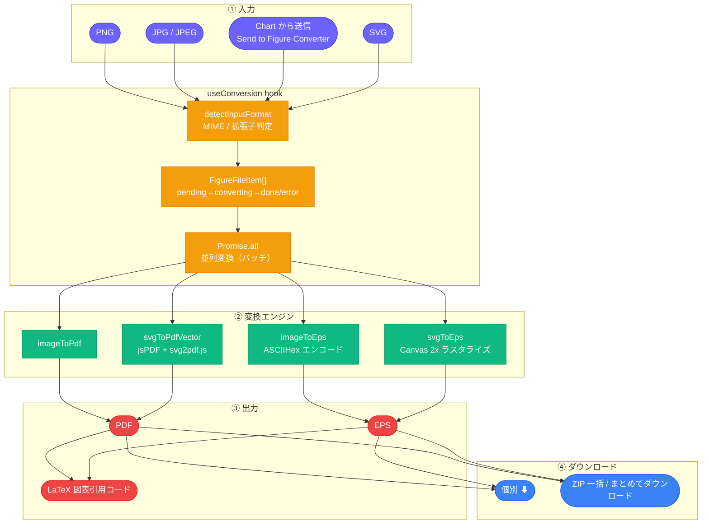
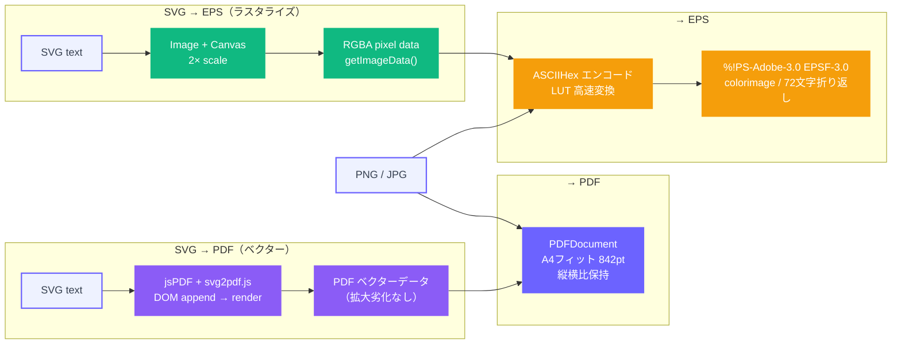

# 画像変換（LaTeX Figure Composer）

[← アーキテクチャ一覧](README.md) | [← README.md](../../README.md)

### システム全体



### 変換パス詳細



### 主要ファイル

```text
src/modules/figure-convert/
├── converters/
│   ├── imageToPdf.ts / svgToPdfVector.ts
│   └── imageToEps.ts / svgToEps.ts
├── hooks/useConversion.ts         # バッチ変換の状態管理
├── components/
│   ├── FileUploader.tsx / FileList.tsx / FormatSelector.tsx
│   └── ConvertButton.tsx / BatchResult.tsx
└── FigureConvertModule.tsx
```

### 設計上の要点

- **SVGはベクターのまま埋め込む**：PNG/JPGはラスタ画像として`pdf-lib`で埋め込むのに対し、SVGは`jsPDF + svg2pdf.js`でベクターPDFとして出力するため、拡大しても劣化しない。EPS変換時のみ、PostScriptがベクターSVGを直接扱えないためCanvasで2倍スケールにラスタライズしてから変換する。
- **バッチ処理は`Promise.all`で並列化**：複数ファイルの変換は`FigureFileItem[]`のステータス（pending→converting→done/error）を個別に管理し、1ファイルの失敗が他ファイルの変換を止めないようにしている。
- **Chart連携（統合時に追加）**：`shared/clipboard`経由でChartが生成したPNGを受け取り、`addFiles()`にそのまま投入する。ダウンロード→再アップロードの手間を排除する連携機能。
