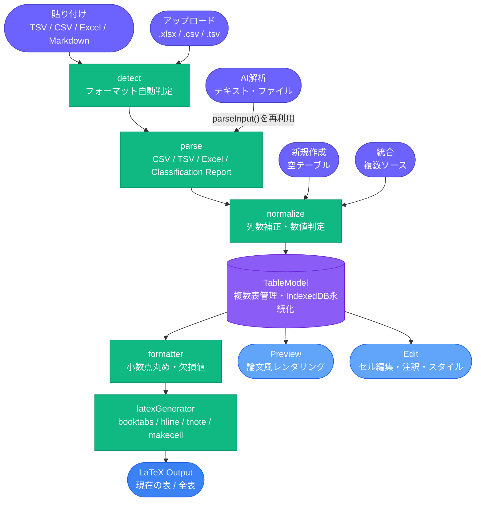
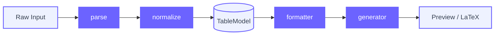
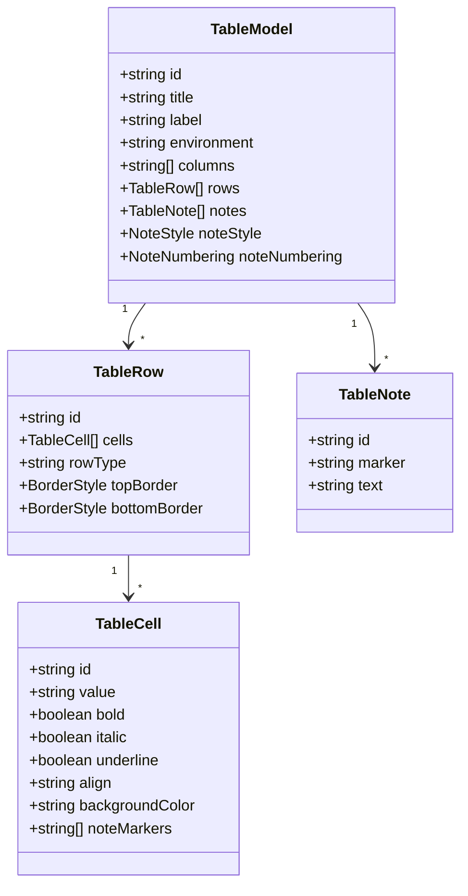

# 表（LaTeX Table Composer）

[← アーキテクチャ一覧](README.md) | [← README.md](../../README.md)

### 主な機能・技術

- 貼り付け / アップロード / 新規作成 / 統合 / AI解析の5つの入力方式。TSV・CSV・Excelコピー・Markdown表・sklearnのclassification reportを自動判定する
- `TableModel` を唯一の状態源（Single Source of Truth）とし、Preview・Edit・LaTeX出力が常に同期する
- セル単位のスタイル編集・範囲選択・注釈（`\tnote{}` / `\footnotemark`）、複数ソースの統合（行/列追加・置換）に対応
- 複数表をタブ管理し、IndexedDB に自動永続化（300msデバウンス）
- フロントエンドのみで変換が完結し、バックエンドは不要

### システム全体



### 処理パイプライン詳細



### データモデル（TableModel）



### 主要ファイル

```text
src/modules/table/
├── lib/table/
│   ├── parser/                    # detect / parseCSV / parseTSV / parseExcel
│   ├── normalize/                 # 列数補正・数値判定
│   ├── formatters/                # 小数点丸め・欠損値表記
│   ├── generators/latexGenerator.ts  # booktabs / hline / tnote / makecell
│   ├── editor/                    # セル・行・列編集操作
│   └── merge/mergeTables.ts       # 複数ソース統合（行/列追加・置換）
├── components/
│   ├── PreviewPanel.tsx / FormattingBar.tsx / TableEditorToolbar.tsx
│   ├── MergePanel.tsx
│   └── OcrImportContent.tsx       # AI解析（テキスト・ファイル→表データ）
└── TableModule.tsx
```

### 設計上の要点

- **TableModel を Single Source of Truth とする**：Preview・Edit・LaTeX出力のすべてが同じ `TableModel` を参照するため、編集内容が即座に他ビューへ反映される。
- **`detect` → `parse` → `normalize` の3段パイプライン**：フォーマット自動判定（TSV/CSV/Excelコピー/Markdown/sklearn classification report）を1つの `parse` 関数に混在させず、判定・変換・整形を分離することで新フォーマット追加時の影響範囲を局所化している。
- **複数表タブ管理の永続化**：`tableSessions` IndexedDB ストアに300msデバウンスで自動保存。初期ダミーテーブルが読み込み中の実データを上書きしないよう `sessionLoaded` フラグでガードしている。
- **AI解析（統合時に追加）**：抽出結果（`{columns, rows}`）を TSV 文字列に変換し、貼り付けタブと全く同じ `parseInput()` に通す設計。専用の確認/編集UIを新設せず、既存の堅牢なパーサーをそのまま再利用している。
